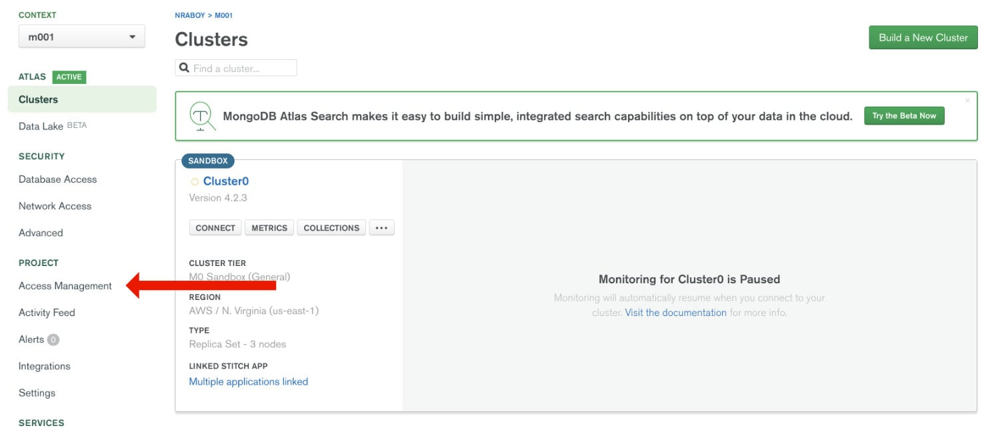
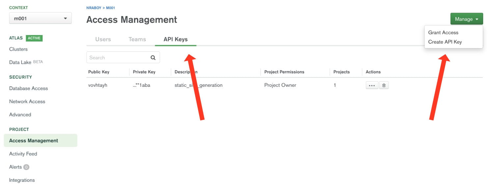
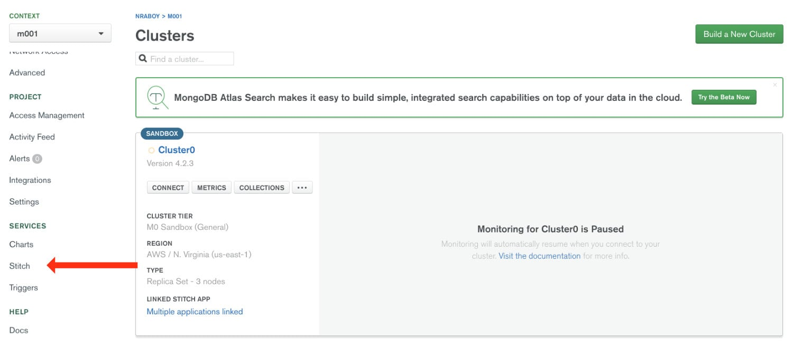
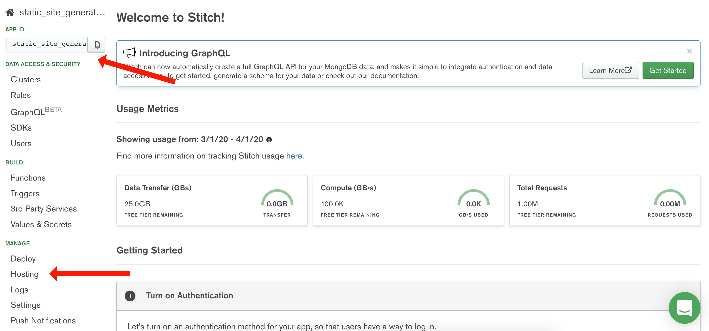
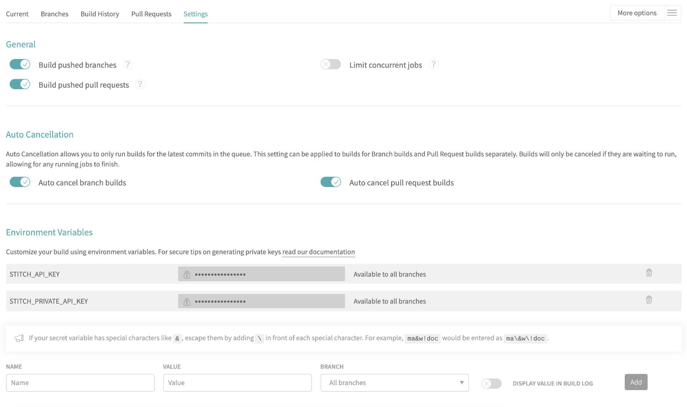

# Static Website Deployments to MongoDB Stitch with Hugo, Git, and Travis CI

[MongoDB Stitch](https://www.mongodb.com/cloud/stitch) can do quite a few things, some of which [include GraphQL](https://developer.mongodb.com/how-to/graphql-support-atlas-stitch), functions as a service, and triggers. However, another awesome feature is in its ability to host static HTML, JavaScript, and CSS, the core components to any static website.

Static websites are becoming more popular due to their performance and how inexpensive it is to host them at scale. Popular generators include Hugo, Jekyll, 11ty, because of how easy it is to write and maintain in a format like Markdown and convert to HTML.

In this tutorial, we're going to see how to create a static hosted website using [Hugo](https://www.gohugo.io) and automatically deploy changes to Stitch through a continuous deployment pipeline consisting of Git and [Travis CI](https://travis-ci.org/).

## The Requirements for the Tutorial

There are a few requirements that must be met before starting this tutorial:

- Node.js 12+
- Hugo 0.58+
- MongoDB Cloud

When it comes to any of the tools involved, please consult the official documentation for installing and configuring those tools.

MongoDB Stitch has a MongoDB Cloud dependency. While we won't be making use of a MongoDB Atlas cluster in this example, having one available is a good idea.

> Apply promotional code [NICRABOY200](https://cloud.mongodb.com) to your MongoDB Cloud account to receive $200.00 in credits towards premium clusters and functionality.

MongoDB Atlas and Stitch have forever free tiers which are more than enough when accomplishing this tutorial.

## Configuring the MongoDB Stitch CLI for Static Website Hosting

There are many ways to get started with the hosting features of MongoDB Stitch, but for this example, we're going to be exploring the CLI because it will have the most compatibility between continuous deployment tools.

From the command line, execute the following:

```bash
npm install -g mongodb-stitch-cli
```

The above command will install the [Stitch CLI](https://docs.mongodb.com/stitch/deploy/stitch-cli-reference/) if you haven't already installed it previously.

After installing the CLI, it won't offer much value until you sign in to your account. This is done through a public and secret key combination that is configured within Atlas.

### Generating a Public and Secret Key in MongoDB Atlas

In MongoDB, a public and secret API key is a way for external applications to gain access to your projects, rather than using a username and password. These keys are assigned permissions based on what your goals are with them.

From the Atlas dashboard, choose **Access Management** in the navigation menu.



Towards the top right of the screen, click the **Manage** button and then select **Create API Key**.



Walk through each of the steps presented, taking note of the public key as well as the private key. For this tutorial to work, the **Project Permissions** should be **Project Owner**.

### Login with the Stitch CLI

You should have noted the public and secret keys from the previous step. They are critical when it comes to signing in with the CLI tool. From the command line, execute the following:

```bash
stitch-cli login --api-key=<my-api-key> --private-api-key=<my-private-api-key>
```

Don't forget to swap the values in the above command with the actual values of your keys. Don't lose track of your keys as they will be used again later in this tutorial.

### Create a Stitch Project and Enable Hosting

Before we go any further with the CLI, a new Stitch project needs to be created and hosting needs to be enabled for the project. This can be done by starting within the MongoDB Atlas dashboard.



Choose to create a new application and give it a name. For this particular example, the default settings can be used for the rest of the creation process.

After the project has been created, two things need to be done.



First, take note of the application id as it will be used alongside the CLI. Next, click **Hosting** from the navigation menu and enable it.

At this point in time hosting is ready, and we can finish configuring the CLI.

### Exporting the Stitch Application for Development

By now, the CLI should be signed in with the public and secret API key, the application id should be available, and hosting should be enabled. We're almost ready to get into the creation of our static website.

From the command line, execute the following command:

```bash
stitch-cli export --app-id=<App ID> --include-hosting
```

The above command will create a project directory on your local computer with the name of your Stitch application. Make sure you include your actual application id for the Stitch application so the correct application is exported.

In the exported project, make sure the **hosting/metadata.json** file exists. If it does not exist, create it and include `[]` as it only needs to be valid JSON for this example.

Deploying the static website is as easy as running the following from the project directory:

```bash
stitch-cli import --include-hosting
```

The above command will deploy everything from within the project's **hosting/files** directory. That directory won't have anything exciting until we start working with Hugo.

More information on using the Stitch CLI for deploying websites can be found in the [official documentation](https://docs.mongodb.com/stitch/hosting/upload-content-to-stitch/).

## Creating a Static Website with Hugo and Markdown

To keep this tutorial simple and easy to understand, we're going to do the bare minimum in terms of Hugo. In fact, much of what you see was taken directly from the [official Hugo documentation](https://gohugo.io/getting-started/quick-start/).

Navigate into your Stitch project and execute the following command:

```bash
hugo new site hugo
```

The above command, assuming Hugo is installed, will create a new Hugo within your Stitch project titled, "hugo". In other words, you'll now have a **hugo** directory within your Stitch project.

Next you'll want to pick a theme for your Hugo website. Execute the following command to use the theme from the Hugo documentation:

```bash
git submodule add https://github.com/budparr/gohugo-theme-ananke.git hugo/themes/ananke
```

Essentially, you're adding the **ananke** theme as a submodule in the **hugo/themes/ananke** path of your project. When the time comes, the submodule will be important for the continuous deployment stage with Travis CI.

When it comes to working with Hugo, you'll want to be within the **hugo** directory of your project. Let's start by defining the theme that we're using in the Hugo configuration:

```bash
echo 'theme = "ananke"' >> config.toml
```

Our Hugo project, content-wise, will be quite empty because it is a new project. Let's get a new post in there so we have something to show. From the command line, execute the following:

```bash
hugo new posts/my-first-post.md
```

The above command will create a **hugo/content/posts/my-first-post.md** file. Open it and make sure you change `draft` to false. When we try to publish, unless we choose to publish drafts, it won't be published by default unless it is listed as not a draft.

Go ahead and test your new Hugo site with the following:

```bash
hugo server
```

The above command will build your static content and serve it at http://localhost:1313. If everything looks good, we can focus on preparing for deployment with the Stitch CLI.

## Static Website Build and Deployment Tasks with Gulp

As seen in the previous steps, it isn't difficult to build a Hugo project or deploy static assets to Stitch. However, you generally wouldn't want to manually run multiple commands any time you wanted to deploy. Instead, a build script or deployment script might make more sense.

Two popular task runner technologies include Gulp and Grunt. For this example, we're going to use [Gulp](https://gulpjs.com/) for building and deploying our website to Stitch.

At the root of your Stitch project create a **gulpfile.js** file and then execute the following commands:

```bash
npm init -y
npm install gulp --save-dev
npm install gulp-cli --save-dev
npm install gulp-clean --save-dev
npm install gulp-shell --save-dev
npm install mongodb-stitch-cli --save-dev
```

The above commands will create a new **package.json** file at the root of your project and then install various packages that will help towards building and deploying the project.

For example, we'll be using `gulp-clean` for cleaning our project of old files before building and we'll be using `gulp-shell` to interact with the command line from JavaScript. We're adding the `mongodb-stitch-cli` package because we want the future deployment services to have access to it locally within a project rather than globally.

So let's try to reproduce what we have been running manually.

Open the project's **gulpfile.js** file and include the following JavaScript code:

```javascript
const { src, series } = require("gulp");
const clean = require("gulp-clean");
const shell = require("gulp-shell");

const stitch = require("./stitch.json");

function cleanTask() { }

function generateTask() { }

function deployTask() { }

exports.clean = cleanTask;
exports.generate = generateTask;
exports.build = series(cleanTask, generateTask);
exports.deploy = series(cleanTask, generateTask, deployTask);
```

The above code is incomplete, however, you can see that we're importing each of the packages that we downloaded and is referencing the **stitch.json** file that exists at the root of our project. We're doing that because it contains configuration information that we'll use.

We have three task functions and four possible tasks which make use of the functions. Let's look at the `cleanTask` function first:

```javascript
function cleanTask() {
    return src(["./hosting/files"], { read: false, allowEmpty: true })
        .pipe(clean());
}
```

When the `cleanTask` function is run, the entire **hosting/files** directory will be removed. This will be done without reading the contents of the directory and it will be done without errors even if the directory doesn't exist.

When it comes to the `generateTask` function, we might have the following:

```javascript
function generateTask() {
    return src("./hugo", { read: true })
        .pipe(shell([
            `cd <%= file.path %> && hugo --baseURL https://${stitch.hosting.app_default_domain}`
        ]));
}
```

The above function will look at the **hugo** directory within our project and pipe the content to our shell. Within the shell command, we are navigating into the **hugo** directory and running the Hugo build command within that directory. We are specifying the URL that exists in our **stitch.json** file as the base URL so our links don't get messed up during the build.

The `generateTask` isn't quite ready for prime time yet. If we were to run it, everything would work, but the output would be sent to the wrong place. We can fix this by changing the Hugo configuration.

Open the project's **hugo/config.toml** file and add the following line:

```
publishDir = "../hosting/files"
```

The above line says that the output from building should be sent to the **hosting/files** directory in the parent directory. Remember, the files we want to send to Stitch need to exist in the **hosting/files** directory.

This brings us to our final task, for the deployment to Stitch. In the `deployTask` we have the following:

```javascript
function deployTask() {
    return src("./hosting", { read: true })
        .pipe(shell([
            `stitch-cli login --private-api-key=${process.env.STITCH_PRIVATE_API_KEY} --api-key=${process.env.STITCH_API_KEY} --yes`,
            `stitch-cli import --include-hosting --yes`
        ]));
}
```

First, we're taking the entire **hosting** directory that exists at the root of our project and we're piping it to the shell. The first command signs in with the public and secret API keys. Notice the use of environment variables for this shell command. If you want to run this task locally, make sure both environment variables are set on your computer with the appropriate data. We'll be doing the same when it comes to Travis CI.

After the sign in happens, we import the files to Stitch.

If you wanted to, you could run the following to build and deploy:

```bash
gulp deploy
```

The above command would clean, generate, and deploy the results to Stitch. You can run this locally, or make it a part of your continuous deployment pipeline which we'll see in the next step.

## Continuous Deployments to MongoDB Stitch with Travis CI

If everything up until now has been successful, we have a Hugo project that will build a static website and deploy it to our Stitch application for static website hosting.

We want this to be an automated process every time we push our changes to GitHub, GitLab, or similar.

For this example, we'll be using GitHub and Travis CI, but with some adjustments, the same rules apply to other platforms and services as well.

Create a new repository on GitHub and then sign in to your Travis CI account. You'll want to activate this project on Travis CI so events start happening when you push your code.

Within Travis CI, open the settings for the particular project and navigate to the **Environment Variables** section.



The keys and values should look similar to what we've done a few times already. You'll want to take your public and secret API keys and add them to this section of Travis CI. Remember, the Gulp task looks for these variables so that way they aren't hardcoded and sent to GitHub.

Once the project is active and the variables are set on Travis CI, we'll need to create a configuration file to be sent with our Git pushes.

Within the root of our Stitch project, create a **.travis.yml** file with the following code:

```
language: node_js
node_js:
    - 12
install:
    - curl -LO https://github.com/gohugoio/hugo/releases/download/v0.58.3/hugo_0.58.3_Linux-64bit.deb
    - sudo dpkg -i hugo_0.58.3_Linux-64bit.deb
before_script:
    - npm install
script:
    - gulp build
deploy:
    provider: script
    script: 
        - gulp deploy
    skip_cleanup: true
    on:
        branch: master
```

The above configuration does a few things. First, we're saying this runner should have everything necessary to run Node.js 12.X code, hence the Gulp tasks that we wish to run. This runner likely won't have Hugo available, so we need to download and install it. Remember, our Gulp task will try to run Hugo, but that doesn't mean it exists on the machine we're using.

After installing our runner dependencies, NPM will install the packages that exist in our **package.json** file. When these packages are available, the build task will run followed by the deploy task.

When you push your entire project to GitHub with this Travis CI configuration, the runner will start and if it doesn't fail, it will automatically push your static output files to Stitch.

## Conclusion

You just saw how to continuously deploy a Hugo powered website to MongoDB Stitch with Travis CI. While it isn't difficult to run these in parts, to maintain a solid deployment pipeline is a huge convenience. Take some of these reasons:

- You don't need to run multiple commands to deploy a Hugo build
- You don't need to push your build files to GitHub as they will be built as part of the process
- Builds won't deploy if they fail during the process
- Travis CI runners can be scheduled which is great for Hugo content with a future publish date

If Hugo isn't your preference, most of these steps can be modified to support other static website generators or other continuous deployment services.
